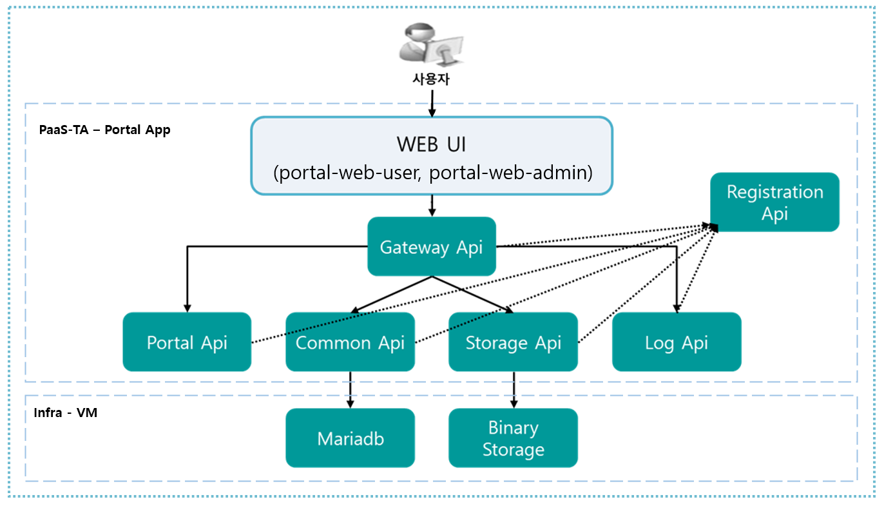

### [Index](../../../README.md) > [AP - Architecture](../README.md) > Portal Architecture - APP Type

## 목적
본 문서(Portal Architecture - APP Type)는 AP Portal - APP TYPE의 Architecture를 제공한다.
  

## 시스템 구성도
APP TYPE의 AP Portal은 Portal Infra와 Portal APP으로 나뉘어있다.  
Portal Infra, Portal APP의 구성과 스펙은 다음과 같다.  
 

 

* Paas-TA Portal infra VM   

| 구분 | 스펙 |
|---------|-------|
| infra (mariadb / binary storage) | 1vCPU / 512MB RAM / 10GB Disk 20GB(영구적 Disk) |

* Paas-TA Portal App

| App명 | 인스턴스 수 | 메모리 | 디스크 |
|--------|-------|-------|-------|
| portal-registration | 1 | 1G | 1G|
| portal-gateway | 1 | 1G | 1G|
| portal-api | N | 2G | 2G|
| portal-common-api | N | 1G | 1G|
| portal-storage-api | N | 1G | 1G|
| portal-log-api | N | 1G | 1G|
| portal-web-admin | N | 1G | 1G|
| portal-web-user | N | 1G | 1G|  

| Deployment | 구분  | 스펙 |
|------------|-------|-----|
| portal-api | binary_storage | 1vCPU / 512MB RAM / 4GB Disk 10GB(영구적 Disk) |
| portal-api | haproxy | 1vCPU / 512MB RAM / 4GB Disk|
| portal-api | mariadb | 1vCPU / 512MB RAM / 4GB Disk +10GB(영구적 Disk) |
| portal-api | paas-ta-portal-registration | 1vCPU / 512MB RAM / 4GB Disk |
| portal-api | paas-ta-portal-gateway | 1vCPU / 512MB RAM / 4GB Disk |
| portal-api | paas-ta-portal-api | 1vCPU / 1GB RAM / 4GB Disk |
| portal-api | paas-ta-portal-common-api | 1vCPU / 512MB RAM / 4GB Disk |
| portal-api | paas-ta-portal-log-api | 1vCPU / 512MB RAM / 4GB Disk |
| portal-api | paas-ta-portal-storage-api | 1vCPU / 512MB RAM / 4GB Disk |
| portal-ui | haproxy | 1vCPU / 512MB RAM / 4GB Disk|
| portal-ui | mariadb | 1vCPU / 512MB RAM / 4GB Disk +10GB(영구적 Disk) |
| portal-ui | paas-ta-portal-webadmin | 1vCPU / 512MB RAM / 4GB Disk |
| portal-ui | paas-ta-portal-webuser | 1vCPU / 512MB RAM / 4GB Disk|
 

### [Index](../../../README.md) > [AP - Architecture](../README.md) > Portal Architecture - VM Type
