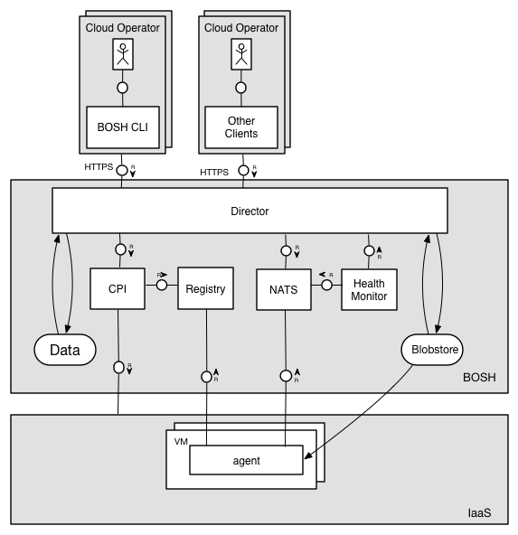

### [Index](https://github.com/okpc579/paasta-guide-new/blob/main/README.md) > [AP Architecture](../README.md) > BOSH

## 목적
본 문서는 BOSH의 Architecture를 제공한다.
<br><br>

## 시스템 구성도
``` 수정중 ```
<br>




<br>

| Deployment |  스펙 |
|------------|------|
| BOSH | 1vCPU / 512MB RAM / 4GB Disk 10GB(영구적 Disk) |


### [Index](https://github.com/okpc579/paasta-guide-new/blob/main/README.md) > [AP Architecture](../README.md) > BOSH
