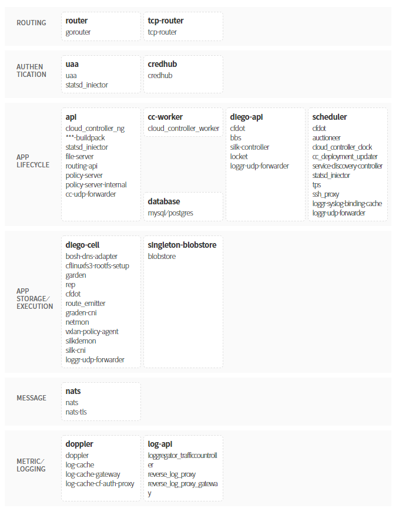

### [Index](https://github.com/okpc579/paasta-guide-new/blob/main/README.md) > [AP Architecture](../README.md) > PaaS-TA AP

## 목적
본 문서는 PaaS-TA Application Platform (AP)의 Architecture를 제공한다.
  

## 시스템 구성도

| 구분  | 인스턴스 수| 스펙 |
|-------|----|-----|
| api | N | 1vCPU / 512MB RAM / 4GB Disk 10GB(영구적 Disk) |

## 설명

### [Index](https://github.com/okpc579/paasta-guide-new/blob/main/README.md) > [AP Architecture](../README.md) > PaaS-TA AP
