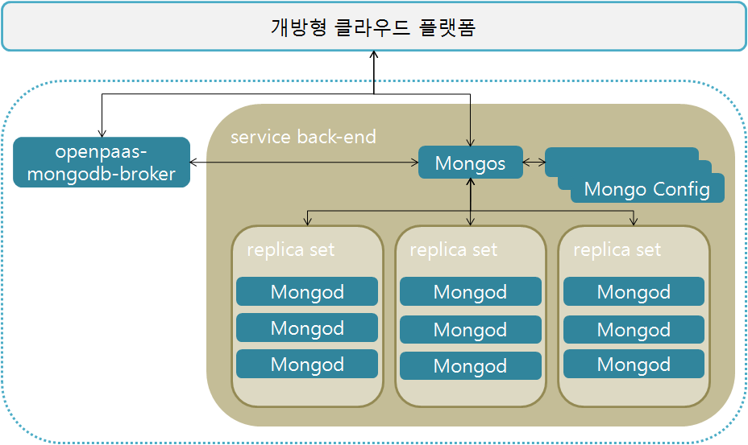

### [Index](https://github.com/okpc579/paasta-guide-new/blob/main/README.md) > [AP Architecture](../README.md) > MongoDB Service

## 목적
본 문서는 Application Platform (AP) - MongoDB Service의 Architecture를 제공한다.
  

## 시스템 구성도

 

| 구분  | 인스턴스 수| 스펙 |
|-------|----|-----|
| mongodb-broker | 1 | 2vCPU / 4GB RAM |
| mongodb_shard | 1 | 2vCPU / 4GB RAM |
| mongodb_config | N | 2vCPU / 4GB RAM / 10GB 추가 디스크 |
| mongodb_master | N | 2vCPU / 4GB RAM / 10GB 추가 디스크 |
| mongodb_worker | N | 2vCPU / 4GB RAM / 10GB 추가 디스크 |

### [Index](https://github.com/okpc579/paasta-guide-new/blob/main/README.md) > [AP Architecture](../README.md) > MongoDB Service
